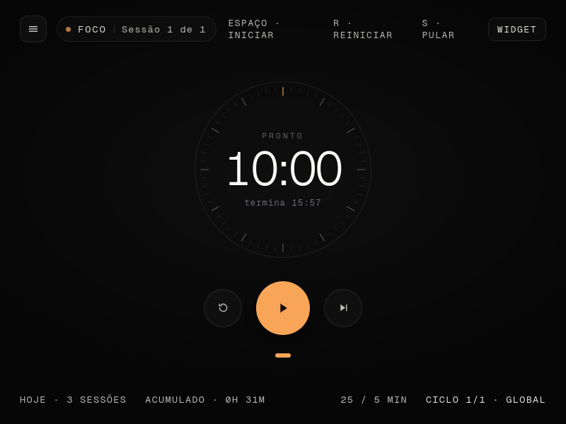
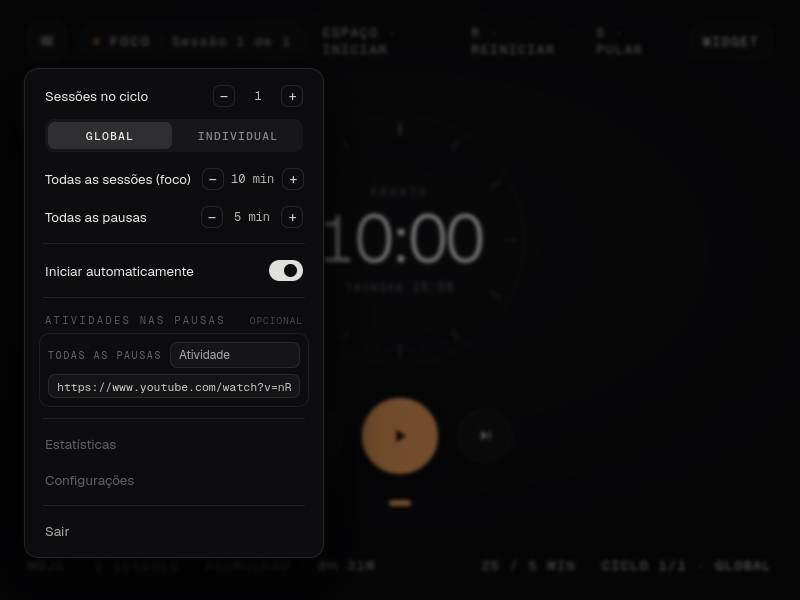
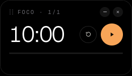

# Pomodoro com descanso ativo

Um Pomodoro para Linux/GNOME em que a **pausa não é tempo morto**. Cada pausa
carrega uma atividade (nome + URL) que o app abre sozinho, em tela cheia, com
saída difícil de propósito — o descanso vira dirigido em vez de virar rolagem
infinita. O timer nunca para durante isso.

## About

O Pomodoro clássico define os 25 minutos de foco e **abandona os 5 de pausa**.
Na prática a pausa vira feed infinito, e voltar do feed custa mais caro que o
descanso rendeu. A tese deste app é que a pausa precisa de **conteúdo definido
antes** e de **atrito para sair**.

Daí saem as decisões que dão forma ao resto:

- **A pausa carrega uma atividade.** Nome + URL, aberta num webview isolado em
  tela cheia. Sem player, sem biblioteca, sem volume: música é só mais uma URL.
  Vídeo do YouTube abre só o player, não o site inteiro.
- **Sair da pausa custa.** Durante o bloqueio o app recusa fechar, desliga os
  próprios atalhos e suprime temporariamente ~30 atalhos do GNOME. A única
  saída é a **Urgência**: um botão escondido no topo, que só aparece no hover,
  com confirmação — e conta como pausa interrompida.
- **O mouse nunca é capturado.** Por decisão, não por limitação: a saída de
  urgência depende do ponteiro.
- **O tempo vem de um prazo absoluto**, não de um acumulador de tick. Suspender
  a máquina no meio de um foco não corrompe nada: ao acordar, o app avança
  **uma** etapa e credita só o tempo até o prazo.

Configuração em **TOML versionado com escrita atômica**, sem banco. TOML
inválido ou de versão desconhecida não derruba o app: ele abre com o default e
move o arquivo ruim para `.corrompido`.

**Não-objetivos:** gerenciar tarefas, rastrear projetos, bloquear sites no
sistema, rodar em Windows ou macOS.

<p align="center">
  
</p>
<p align="center">
  
</p>
<p align="center">
  
</p>

## Stacks

| Camada | Tecnologia |
|---|---|
| Núcleo / lógica | Rust (edition 2021), crates de domínio sem Tauri, `fs` ou relógio do SO |
| Shell desktop | Tauri 2 (webkit2gtk), janelas de bloqueio e widget em processos próprios |
| Frontend | React 19 + TypeScript + Vite; `bindings.ts` gerado a partir do contrato Rust |
| Persistência | TOML versionado com escrita atômica — sem banco |
| Atalhos do GNOME | supressão via gsettings com journal em disco e restauração garantida |
| CI | GitHub Actions (back e front) + `scripts/ci.sh` como porta única local |

## Como instalar

Não há release publicada — a via documentada é compilar do fonte.

### Requisitos

| Item | Versão |
|---|---|
| Linux com GNOME | testado em GNOME 50 / mutter, sessão Wayland |
| Rust | stable |
| Node | 22+ |
| pnpm | 9+ |

**Sessão Wayland, app sob XWayland.** O binário exporta `GDK_BACKEND=x11`
sozinho — você não precisa setar nada. Em Wayland puro `set_position` é
ignorado e always-on-top não existe, o que mataria o widget flutuante e a
tomada de foco. Fora do GNOME o app roda, mas o bloqueio degrada para "tela
cheia + fechar recusado": a supressão de atalhos não tem equivalente portável.

### Dependências de sistema

```bash
# Arch
sudo pacman -S --needed webkit2gtk-4.1 base-devel curl wget file openssl \
  appmenu-gtk-module libappindicator-gtk3 librsvg xdotool

# Debian / Ubuntu
sudo apt install libwebkit2gtk-4.1-dev libjavascriptcoregtk-4.1-dev \
  libayatana-appindicator3-dev librsvg2-dev libssl-dev libxdo-dev patchelf build-essential
```

### Build

```bash
git clone git@github.com:CaioNazario/pomodoro-desktop.git
cd pomodoro-desktop/pomodoro
pnpm install
pnpm tauri build
```

Os pacotes saem em `pomodoro/target/release/bundle/`:

| Formato | Caminho | Serve pra |
|---|---|---|
| Binário solto | `target/release/pomodoro` | integração local / Arch |
| AppImage | `bundle/appimage/pomodoro_0.1.0_amd64.AppImage` | qualquer distro, sem instalar nada |
| `.deb` | `bundle/deb/pomodoro_0.1.0_amd64.deb` | Debian / Ubuntu |
| `.rpm` | `bundle/rpm/pomodoro-0.1.0-1.x86_64.rpm` | Fedora / RHEL |

Se a máquina não tiver `fuse2`, rode o AppImage com `APPIMAGE_EXTRACT_AND_RUN=1`
na frente. Em Arch rolling, a etapa do AppImage pode falhar com
`failed to run linuxdeploy` (o `strip` em cache não reconhece `.relr.dyn`); o
binário solto e o `.deb`/`.rpm` não são afetados.

### Rodar

```bash
# desenvolvimento, com hot reload
pnpm tauri dev

# ou o binário compilado
GDK_BACKEND=x11 ./target/release/pomodoro
```

Para instalar localmente sem `sudo`, copie `target/release/pomodoro` para
`~/.local/bin/` e um `.desktop` para `~/.local/share/applications/`.

## Licença

[MIT](LICENSE) © Caio Nazário
